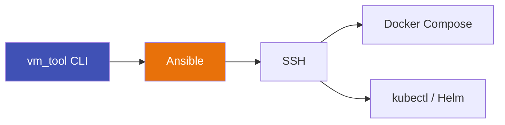

# VM Tool

A deployment automation platform for Docker and Kubernetes applications, powered by Ansible.

<div class="grid cards" markdown>

-   :material-rocket-launch:{ .lg .middle } **Deploy in one command**

    ---

    Push Docker Compose apps or K8s manifests to remote servers with a single CLI command.

    ```bash
    vm_tool deploy-docker --profile production
    ```

-   :material-shield-check:{ .lg .middle } **Safe by default**

    ---

    Idempotent deployments, dry-run mode, production confirmation prompts, and one-command rollback.

-   :material-kubernetes:{ .lg .middle } **Docker & Kubernetes**

    ---

    Deploy Docker Compose apps or Kubernetes manifests/Helm charts — same CLI, same workflow.

-   :material-history:{ .lg .middle } **Track everything**

    ---

    Deployment history, drift detection, backup/restore, and health checks built in.

</div>

---

## Install

```bash
pip install vm-tool
```

## Deploy in 60 Seconds

```bash
# 1. Create a profile
vm_tool config create-profile prod \
  --environment production \
  --host 10.0.2.10 \
  --user ubuntu

# 2. Deploy
vm_tool deploy-docker --profile prod --health-port 8000

# 3. If something breaks
vm_tool rollback --host 10.0.2.10
```

---

## What vm_tool Does



**You run simple commands. Ansible handles the hard parts.**

- Idempotent deployments (only redeploys on changes)
- Multi-host support
- Health checks after every deployment
- Full deployment history with rollback

---

## Core Features

| Feature | Command |
|---------|---------|
| Docker deployment | `vm_tool deploy-docker --profile prod` |
| Kubernetes deployment | `vm_tool deploy-k8s --method manifest --manifest app.yml` |
| Deployment history | `vm_tool history --host 10.0.2.10` |
| Rollback | `vm_tool rollback --host 10.0.2.10` |
| Drift detection | `vm_tool drift-check --host 10.0.2.10` |
| Backup & restore | `vm_tool backup create --host 10.0.2.10 --paths /app` |
| CI/CD generation | `vm_tool generate-pipeline` |
| Secrets sync | `vm_tool secrets sync --env-file .env --repo owner/repo` |
| Dry-run | `vm_tool deploy-docker --profile prod --dry-run` |
| Prerequisites check | `vm_tool doctor` |
| Deployment status | `vm_tool status` |

---

## Roadmap

- GitOps integration (ArgoCD/Flux)
- Web dashboard
- Notification webhooks (Slack/Discord)

---

## Links

- [GitHub Repository](https://github.com/thesunnysinha/vm_tool)
- [PyPI Package](https://pypi.org/project/vm-tool/)
- [Issue Tracker](https://github.com/thesunnysinha/vm_tool/issues)
