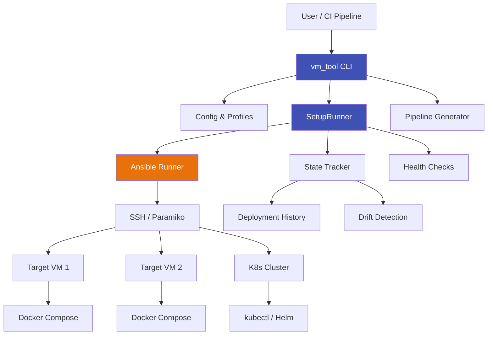
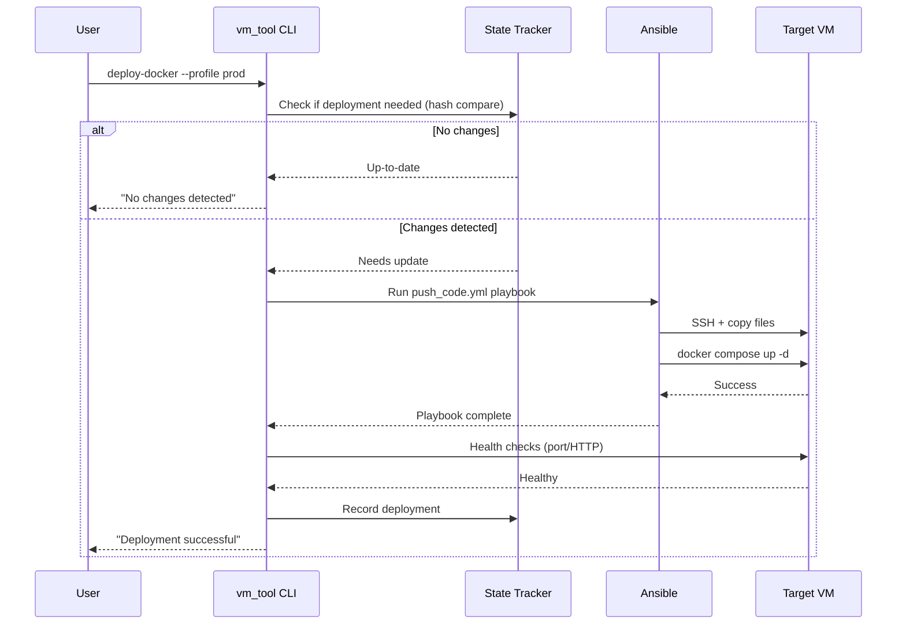
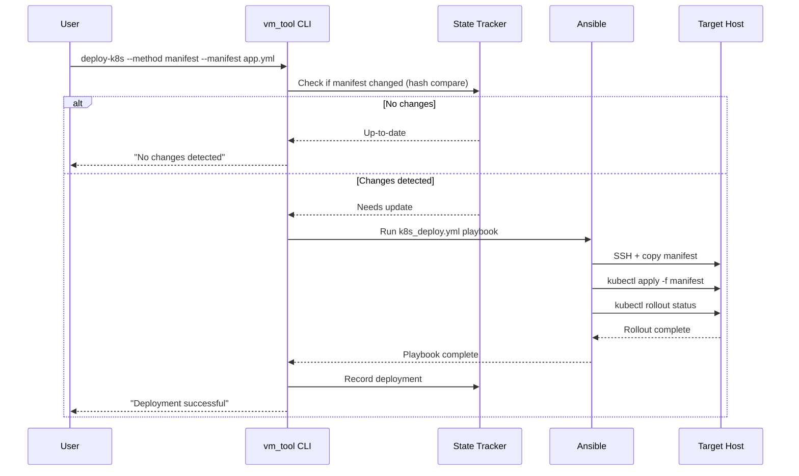
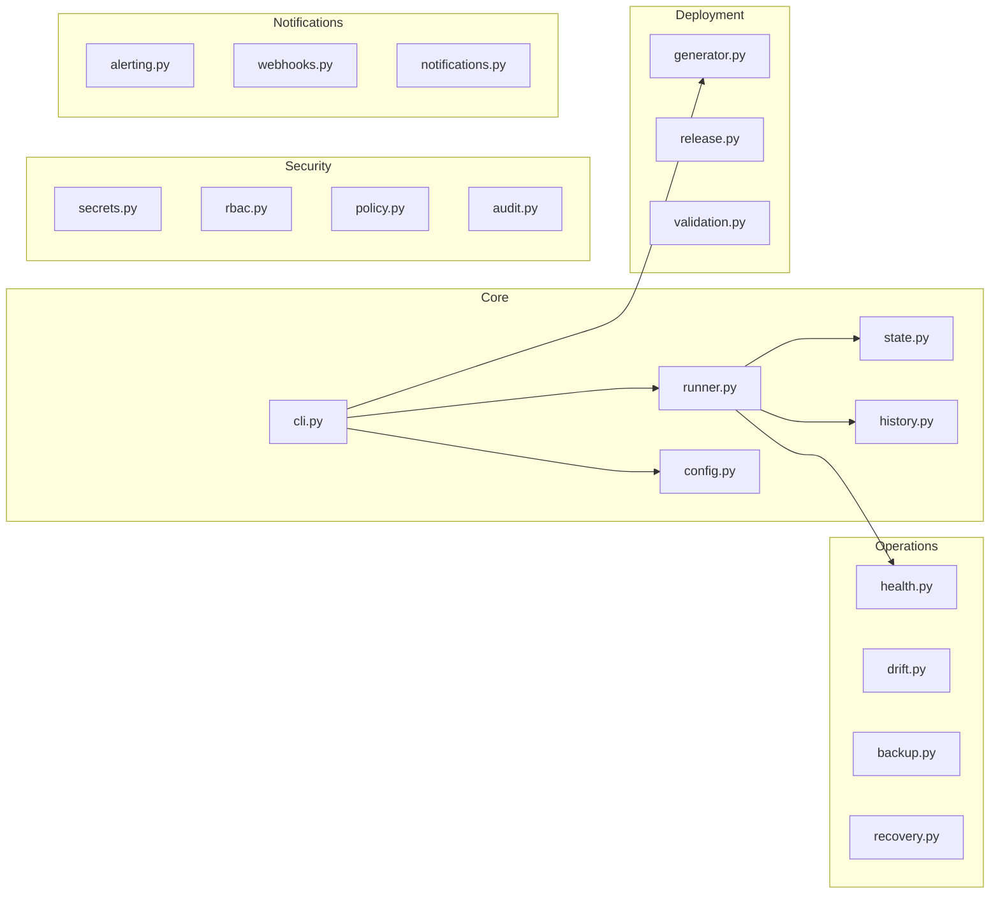

# Architecture

## Overview

vm_tool is a CLI-driven deployment automation platform. Users issue commands, which are translated into Ansible playbooks executed against remote hosts via SSH.

## Core Flow

### Docker Deployment

### Kubernetes Deployment

## Module Map

## Key Design Decisions

**Ansible as execution engine** — Instead of implementing SSH command execution directly, vm_tool delegates to Ansible playbooks. This provides idempotency, error handling, and multi-host support out of the box.

**Hash-based idempotency** — Deployment state is tracked via SHA-256 hashes of compose files or K8s manifests. This allows vm_tool to skip unnecessary redeployments automatically.

**Profile system** — Deployment configurations are saved as profiles, enabling one-command deployments (`--profile prod`) and reducing the risk of misconfiguration.

**Plugin-friendly architecture** — Alert channels, deployment strategies, and cloud providers all follow an abstract base class pattern, allowing extension without modifying core code.
