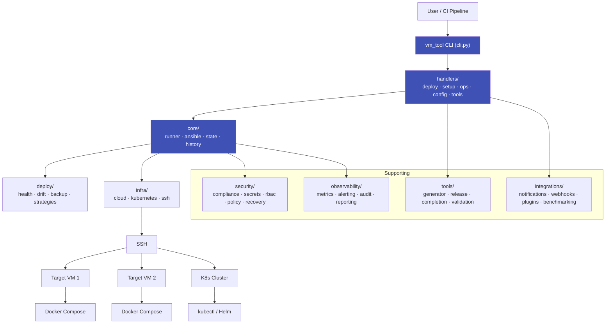
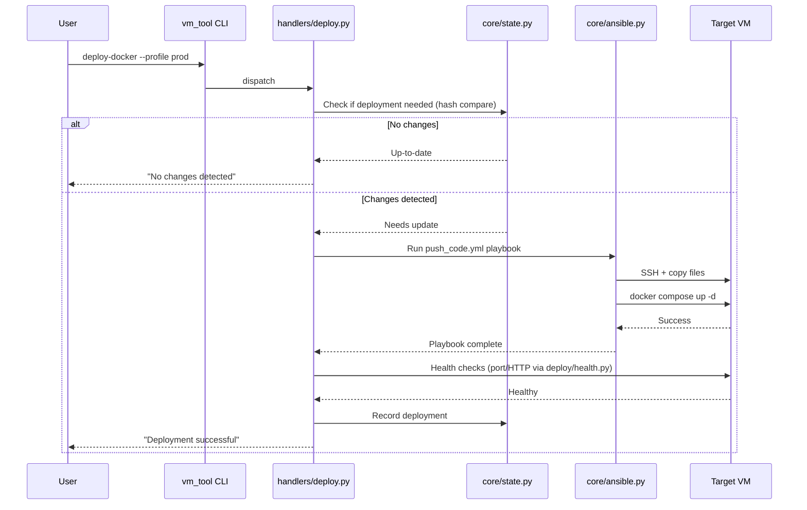
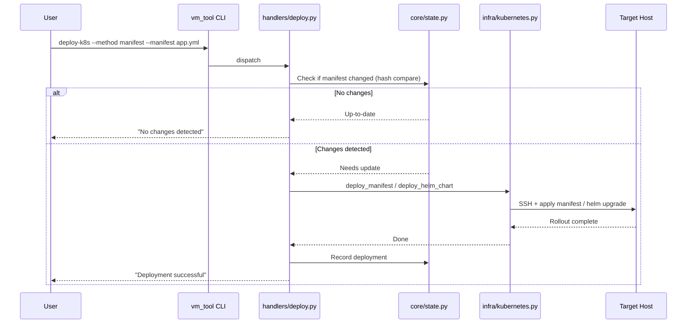

# Architecture

## Overview

vm_tool is a CLI-driven deployment automation platform. Users issue commands via the CLI, which are routed through handler modules into the core orchestration layer, then out to infrastructure via Ansible and SSH.

## Subpackage Layers

| Layer | Subpackage | Responsibility |
|-------|-----------|----------------|
| Entry | `cli.py`, `console.py` | Typer CLI definition, Rich console |
| Routing | `handlers/` | Thin command handlers; translate CLI args to core calls |
| Orchestration | `core/` | `SetupRunner`, Ansible wrapper, state tracking, history |
| Deployment | `deploy/` | Health checks, drift detection, backup/restore, deployment strategies |
| Infrastructure | `infra/` | Cloud VM lifecycle (AWS/GCP/Azure), Kubernetes/Helm, SSH |
| Security | `security/` | Compliance scanning, secrets sync, RBAC, policy, recovery |
| Observability | `observability/` | Metrics, alerting, audit logs, reporting |
| Tooling | `tools/` | Pipeline generation, release prep, shell completion, validation |
| Integrations | `integrations/` | Notifications, webhooks, plugin system, benchmarking |
| Configuration | `config/` | Profile and settings management |

## Core Flow

### Docker Deployment

### Kubernetes Deployment

## Key Design Decisions

**Handler-based routing** — `handlers/` modules sit between the CLI and the core, keeping command dispatch thin and testable. Each handler file corresponds to a command group (`deploy`, `setup`, `ops`, `config`, `tools`).

**Ansible as execution engine** — Instead of implementing SSH command execution directly, vm_tool delegates to Ansible playbooks. This provides idempotency, error handling, and multi-host support out of the box.

**Hash-based idempotency** — Deployment state is tracked via SHA-256 hashes of compose files or K8s manifests. This allows vm_tool to skip unnecessary redeployments automatically.

**Profile system** — Deployment configurations are saved as profiles, enabling one-command deployments (`--profile prod`) and reducing the risk of misconfiguration.

**Abstract strategy pattern** — Deployment strategies (`blue_green`, `canary`, `ab_testing`) implement `_deploy_to_host` but declare `_switch_traffic` as abstract. Users subclass to wire in their own traffic-shifting logic.

**Plugin-friendly architecture** — Alert channels, deployment strategies, and cloud providers all follow an abstract base class pattern, allowing extension without modifying core code.
